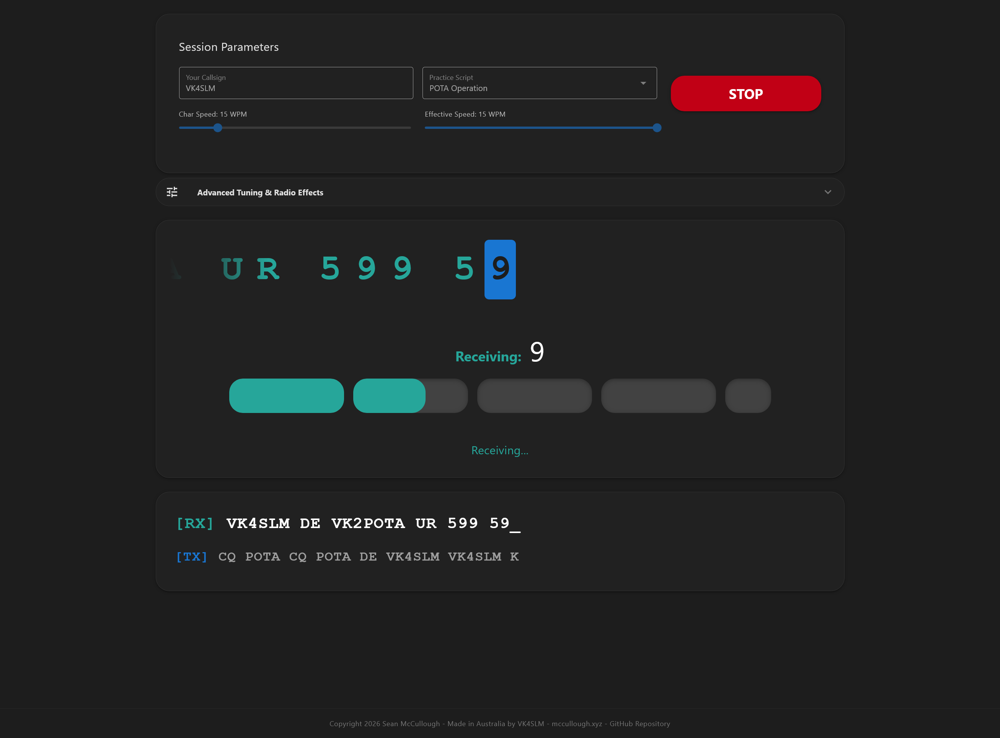

# On-Air CW Trainer

[Live Demo](https://cw.mccullough.xyz)



## Overview

Learning Morse code (CW) shouldn't just be about memorizing dits and dahs in a sterile vacuum. To truly become proficient and confident, amateur radio operators need to experience the rhythm, spacing, and unpredictability of real HF band conditions.

This progressive web application is designed to bridge the gap between rote memorization and practical operation. Built around the proven Farnsworth method, the trainer helps you build character recognition at realistic target speeds while keeping word spacing manageable. Beyond just timing, it actively simulates the feeling of being on the air. With click-free Web Audio sidetones, simulated atmospheric HF static (QRN), dynamic signal fading (QSB), and full break-in (QSK) mechanics, this tool trains your ear to pull signals out of the noise. Whether you are prepping for your first live QSO, chasing DX, or getting ready for a Parks on the Air (POTA) activation, this trainer builds the muscle memory and auditory processing needed for the real world.

# Features

- **Realistic QSO Scripts**: Practice standard CQ calls, grid square exchanges, and POTA templates.

- **Farnsworth Timing**: Independently adjust character WPM and effective WPM to build reflex memory without frustration.

- **Dynamic Visual Pacer**: A real-time progress bar guides your keying rhythm so you aren't just reacting, but flowing with the timing.

- **Authentic Radio Effects**:

      Click-free, exponentially enveloped CW tones.

      Simulated HF ionosphere static that properly mutes during your transmit phase (QSK).

      Slow sine-wave signal fading (QSB) on the receiving station.

      Randomized RX frequency offsets so you aren't perfectly zero-beat.

- **Persistent Settings**: Your callsign, speeds, and audio preferences are saved locally to your browser.

# Getting Started

This project is built using Vue 3 (Composition API), Vite, TypeScript, and Quasar.
Prerequisites

Ensure you have Node.js installed on your machine.

# Installation

1. **Clone the repository:**

```bash
git clone https://github.com/SeanLMcCullough/cw.git
cd cw
```

2. **Install dependencies:**

```bash
npm install
```

## Development

To start the local development server with hot-module replacement:

```bash
npm run dev
```

## Build for Production

To compile and minify the application for production deployment:

```bash
npm run build
```

The compiled, static assets will be output to the /dist directory, ready to be hosted on GitHub Pages or any static web server.

## Author

Made in Australia by Sean McCullough (VK4SLM).

Website: https://mccullough.xyz

## License

This project is licensed under the MIT License.

## Disclaimer

This application was developed with the assistance of Google Gemini.
